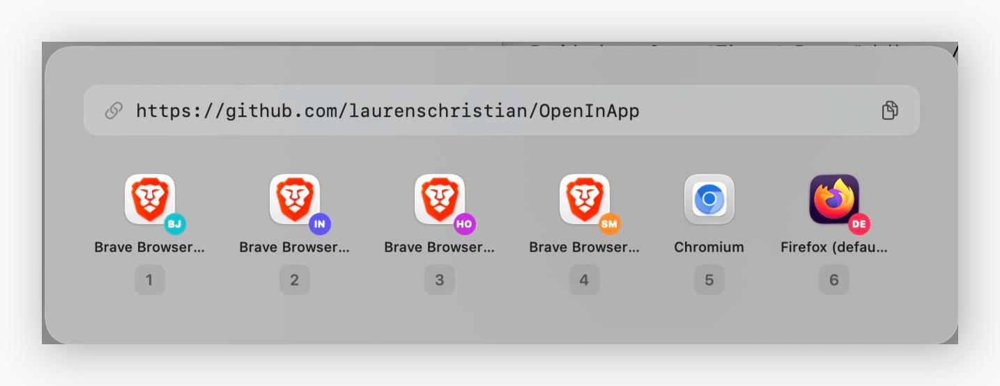

<p align="center">
  
</p>

<h1 align="center">OpenIn</h1>

<p align="center">
A fast, native macOS URL router and browser picker.<br>
<a href="https://github.com/laurenschristian/OpenInApp/releases/latest"></a>
</p>

## Features

- **Native macOS app** -- SwiftUI + AppKit, no Electron, no web views
- **Browser picker** -- popup appears near your mouse with all installed browsers
- **Keyboard shortcuts** -- Cmd+1 through Cmd+9 for instant selection
- **Rules engine** -- route URLs automatically based on domain patterns, regex, and source app
- **Source app detection** -- match rules based on which app opened the URL
- **Browser profiles** -- open in specific Chrome profiles or Firefox profiles
- **Private/incognito mode** -- per-rule incognito support
- **URL rewriting** -- auto-strip tracking params, force HTTPS
- **Copy URL** -- copy button in the picker popup
- **Recently used** -- last-used browser gets a blue dot and moves to front
- **Recent URLs** -- quick access from the menu bar dropdown
- **Launch at login** -- optional startup item
- **First-launch onboarding** -- guided setup on first run
- **Lightweight** -- ~1.9MB DMG, ~10MB memory footprint
- **macOS 14+** -- Apple Silicon and Intel

## Installation

### Download

Grab the latest `.dmg` from [Releases](https://github.com/laurenschristian/OpenInApp/releases), open it, and drag OpenIn to `/Applications`.

### Build from source

```sh
git clone https://github.com/laurenschristian/OpenInApp.git
cd OpenInApp
open OpenIn.xcodeproj
```

Build with Xcode 15+ targeting macOS 14+. See [Building from Source](#building-from-source) for details.

## Screenshot

<p align="center">
  
</p>

## Quick Start

1. Open OpenIn from `/Applications`
2. Go to Settings > General and click **Set as Default Browser**
3. macOS will ask you to confirm
4. Click any link -- OpenIn intercepts it
5. If a rule matches, the URL opens in the target browser automatically
6. If no rule matches, the picker popup appears near your mouse
7. Click a browser or press Cmd+1-9

## Configuration

Config lives at `~/.config/openin/config.json`. Edit it directly or use the Settings UI.

```json
{
  "defaultBrowserID": "com.apple.Safari",
  "hideAfterPick": true,
  "showPickerOnNoMatch": true,
  "rules": [
    {
      "name": "GitHub",
      "pattern": "*.github.com",
      "isRegex": false,
      "targetBrowserID": "com.google.Chrome",
      "enabled": true
    },
    {
      "name": "Google Docs from Slack",
      "pattern": "https://docs\\.google\\.com/.*",
      "isRegex": true,
      "sourceAppBundleID": "com.tinyspeck.slackmacgap",
      "targetBrowserID": "com.google.Chrome",
      "enabled": true
    },
    {
      "name": "Work apps in Chrome Work profile",
      "pattern": "*.atlassian.net",
      "isRegex": false,
      "targetBrowserID": "com.google.Chrome",
      "profileDirectory": "Profile 2",
      "enabled": true
    }
  ]
}
```

## Rules

Rules are evaluated top-to-bottom. The first match wins. If no rule matches, the picker appears (or the default browser is used, depending on your settings).

### Rule fields

| Field | Required | Description |
|---|---|---|
| `name` | yes | Display name |
| `pattern` | yes | Glob or regex pattern to match against the URL |
| `isRegex` | no | `true` for regex, `false` for glob (default: `false`) |
| `targetBrowserID` | yes | Bundle ID of the target browser |
| `sourceAppBundleID` | no | Only match URLs opened from this app |
| `profileDirectory` | no | Chrome profile directory or Firefox profile name |
| `privateMode` | no | Open in private/incognito window |
| `enabled` | no | `true` or `false` (default: `true`) |

### Pattern examples

| Pattern | Type | Matches |
|---|---|---|
| `*.github.com` | glob | `github.com`, `gist.github.com`, `docs.github.com` |
| `*.google.com` | glob | `mail.google.com`, `docs.google.com` |
| `notion.so` | glob | Any URL containing `notion.so` |
| `*jira*` | glob | Any URL containing `jira` |
| `https://docs\\.google\\.com/.*` | regex | Google Docs URLs only |
| `https://(dev\|staging)\\.example\\.com` | regex | Dev and staging environments |

### Common browser bundle IDs

| Browser | Bundle ID |
|---|---|
| Safari | `com.apple.Safari` |
| Chrome | `com.google.Chrome` |
| Firefox | `org.mozilla.firefox` |
| Arc | `company.thebrowser.Browser` |
| Brave | `com.brave.Browser` |
| Edge | `com.microsoft.edgemac` |
| Orion | `com.kagi.kagimacOS` |

## URL Rewriting

OpenIn can automatically clean URLs before opening them:

- **Tracking parameter removal** -- strips `utm_source`, `utm_medium`, `utm_campaign`, `utm_term`, `utm_content`, `fbclid`, `gclid`, and other common tracking parameters
- **Force HTTPS** -- upgrades `http://` URLs to `https://` automatically

This happens transparently before the URL is passed to the target browser.

## Browser Profiles

OpenIn supports opening URLs in specific browser profiles.

**Chrome** -- use the profile directory name (found in `chrome://version` under "Profile Path"):

```json
{
  "name": "Work in Chrome Work Profile",
  "pattern": "*.company.com",
  "targetBrowserID": "com.google.Chrome",
  "profileDirectory": "Profile 2"
}
```

Chrome is launched with `--profile-directory="Profile 2"`.

**Firefox** -- use the profile name:

```json
{
  "name": "Dev in Firefox Dev Profile",
  "pattern": "localhost*",
  "targetBrowserID": "org.mozilla.firefox",
  "profileDirectory": "dev-profile"
}
```

Firefox is launched with `-P dev-profile`.

## Building from Source

Requirements:
- Xcode 15+
- macOS 14+

```sh
git clone https://github.com/laurenschristian/OpenInApp.git
cd OpenInApp
open OpenIn.xcodeproj
```

1. Select the OpenIn scheme
2. Build and run (Cmd+R)
3. To create a release build: Product > Archive

The built app can be copied to `/Applications`.

## Contributing

Contributions are welcome.

1. Fork the repository
2. Create a feature branch (`git checkout -b feature/my-feature`)
3. Commit your changes
4. Push to the branch
5. Open a pull request

Please open an issue first for major changes to discuss the approach.

## License

MIT License. See [LICENSE](LICENSE).
